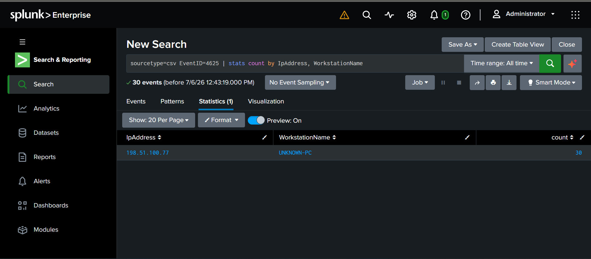
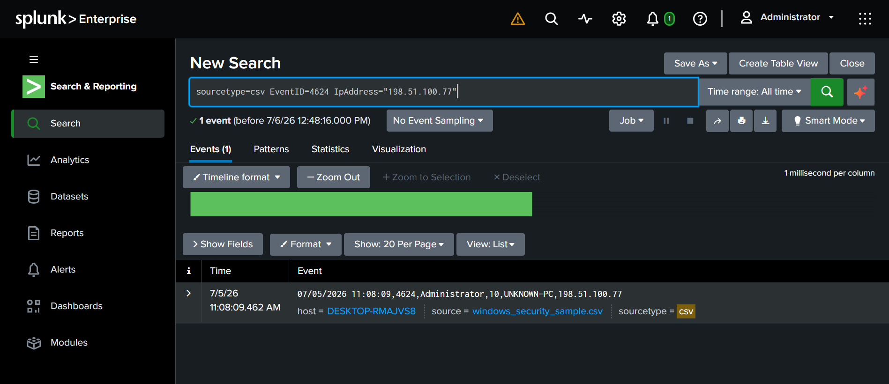
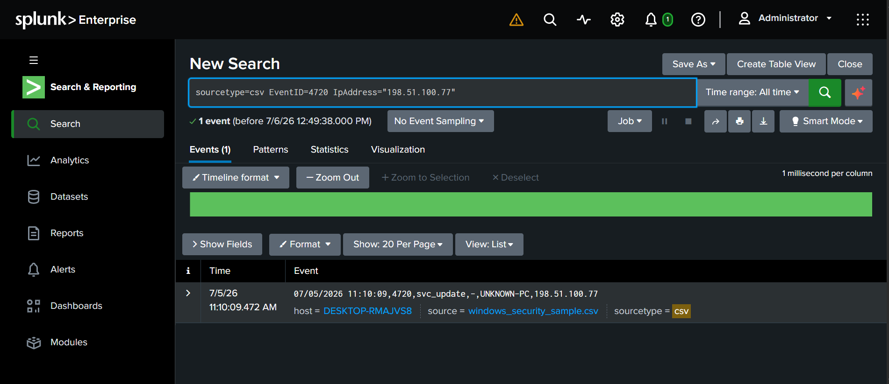

# Investigation 2: Windows RDP Brute-Force & Persistence (Account Creation)

## Overview
A second Splunk investigation, this time using structured Windows Security Event log data (CSV) instead of raw text logs — practicing field-based filtering rather than regex extraction, and tracing a full attack chain from initial access through persistence.

## Scenario
A synthetic Windows Security Event log (`windows_security_sample.csv`) was ingested into Splunk, containing normal employee logons alongside a simulated RDP brute-force attack, successful breach, and attacker persistence via a newly created admin account.

Fields (`EventID`, `TargetAccount`, `LogonType`, `WorkstationName`, `IpAddress`) were automatically extracted by Splunk from the CSV headers — no `rex` required for this dataset.

## Investigation Steps

### 1. Detect the brute-force burst
```spl
sourcetype=csv EventID=4625
```
Filtered directly on Windows Event ID `4625` (failed logon). Returned 30 events.

### 2. Identify the attacker's source
```spl
sourcetype=csv EventID=4625 | stats count by IpAddress, WorkstationName
```
**Result:** All 30 failed attempts originated from a single source — IP `198.51.100.77`, workstation `UNKNOWN-PC`. The unrecognized workstation naming convention (vs. the organization's standard `WKSTN-##` pattern) was an immediate red flag.



### 3. Confirm the breach
```spl
sourcetype=csv EventID=4624 IpAddress="198.51.100.77"
```
**Result:** A successful logon (Event ID `4624`) as `Administrator` from `UNKNOWN-PC`, occurring immediately after the failed-login burst — confirming the brute-force attempt succeeded.



### 4. Detect persistence — new account creation
```spl
sourcetype=csv EventID=4720 IpAddress="198.51.100.77"
```
**Result:** Two minutes after breaching the account, the attacker created a new local account, `svc_update` — a name deliberately chosen to blend in with legitimate service accounts.



### 5. Detect privilege escalation
```spl
sourcetype=csv EventID=4732 IpAddress="198.51.100.77"
```
**Result:** The newly created `svc_update` account was added to a privileged security group shortly after creation — giving the attacker a persistent, admin-level backdoor independent of the original compromised credential.


## Attack Chain Summary
1. **~30 failed RDP login attempts** against `Administrator` from unrecognized host `UNKNOWN-PC` (`198.51.100.77`)
2. **Successful brute-force login** as `Administrator`
3. **New account created** (`svc_update`), disguised as a legitimate service account
4. **New account escalated** to a privileged group — persistent backdoor established

This maps to a classic MITRE ATT&CK-style chain: Brute Force → Valid Accounts → Create Account → Account Manipulation.

## Recommended Response 
- Immediately disable/delete the `svc_update` account.
- Reset the compromised `Administrator` password.
- Block `198.51.100.77` at the firewall/edge.
- Audit all activity performed by `svc_update` before it was identified.
- Review RDP exposure and account lockout policy — 30 failed attempts should have triggered a lockout well before success.

## Tools Used
- Splunk Enterprise (local install)
- SPL commands: field-based filtering (`EventID=`), `stats`
- Structured CSV field extraction (no regex required)
