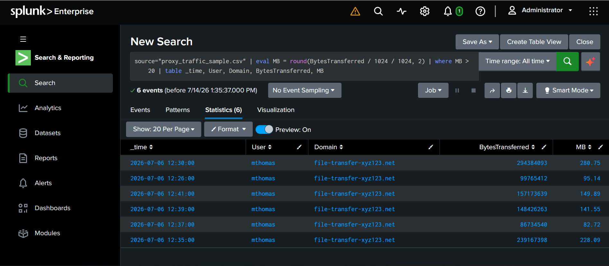
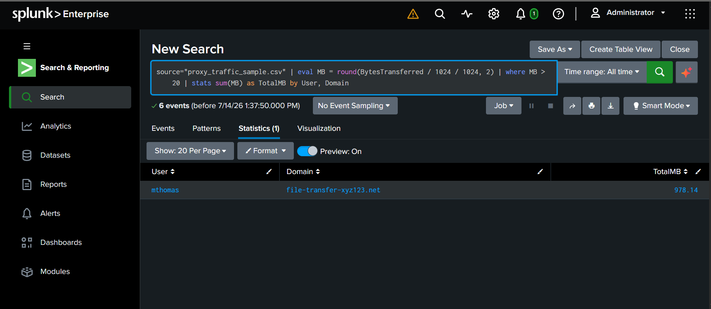

# Investigation 3: Data Exfiltration Detection (eval / where)

## Overview
A third Splunk investigation, shifting from authentication-based attacks (brute-force) to a data exfiltration scenario — practicing `eval` (calculated fields) and `where` (numeric/conditional filtering), two SPL commands that go beyond simple text matching.

## Scenario
A synthetic web/proxy traffic log (`proxy_traffic_sample.csv`) was ingested into Splunk, containing normal browsing traffic to legitimate domains (Slack, Outlook, GitHub, Zoom) mixed with a burst of unusually large outbound transfers from a single user to an unrecognized external domain.

## Investigation Steps

### 1. Calculate a human-readable transfer size
Raw byte values are hard to interpret at a glance, so `eval` was used to convert `BytesTransferred` into megabytes:
```spl
source="proxy_traffic_sample.csv" | eval MB = round(BytesTransferred / 1024 / 1024, 2) | table _time, User, Domain, BytesTransferred, MB
```
This creates a new calculated field (`MB`) without filtering anything yet — just making the data easier to reason about.

### 2. Isolate unusually large transfers
```spl
source="proxy_traffic_sample.csv" | eval MB = round(BytesTransferred / 1024 / 1024, 2) | where MB > 20 | table _time, User, Domain, BytesTransferred, MB
```
`where` filtered the dataset down to only transfers larger than 20MB — something a plain text search can't do, since it requires evaluating a numeric condition rather than matching a keyword.

**Result:** 6 transfers, all from user `mthomas`, all to the same unrecognized domain `file-transfer-xyz123.net`, ranging from ~82MB to ~280MB, all within a 15-minute window on the same afternoon.



### 3. Quantify total data volume
```spl
source="proxy_traffic_sample.csv" | eval MB = round(BytesTransferred / 1024 / 1024, 2) | where MB > 20 | stats sum(MB) as TotalMB by User, Domain
```
Aggregated the filtered results into a single reportable figure — the number an analyst would actually lead with in an incident report.

**Result:** `mthomas` transferred approximately **978 MB** to `file-transfer-xyz123.net` in a single session.



## Findings
- User `mthomas` transferred ~978 MB of data to an unrecognized external domain within a 15-minute window — inconsistent with normal browsing patterns seen from other users in the same dataset.
- The destination domain does not match any known/approved business service (unlike the legitimate traffic to Slack, Outlook, GitHub, and Zoom seen elsewhere in the log).
- The pattern — several large sequential transfers in a short window to a single unfamiliar domain — is consistent with data exfiltration.

## Recommended Response (as a SOC Analyst would document)
- Isolate the affected endpoint pending investigation.
- Determine what data was transferred (file names/types, if available from proxy metadata).
- Block the destination domain at the proxy/firewall.
- Review the user's recent activity and access levels for signs of compromise vs. insider action.
- Add a correlation rule/alert for future outbound transfers exceeding a defined size threshold to unrecognized domains.

## Tools Used
- Splunk Enterprise (local install)
- SPL commands: `eval`, `where`, `stats sum() as`, `round()`
