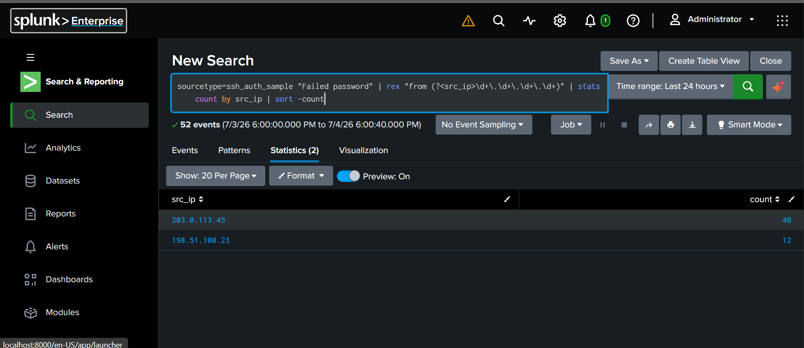
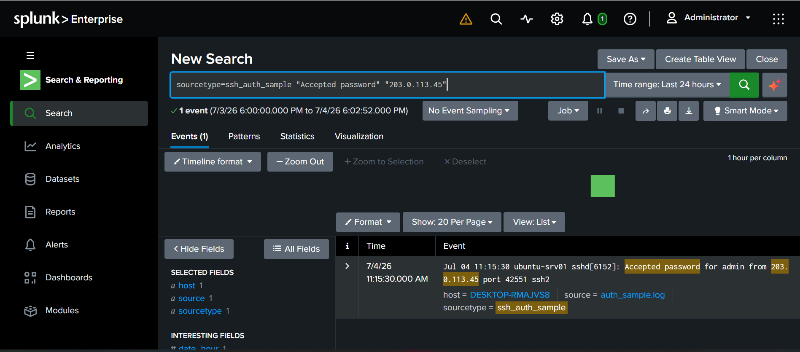
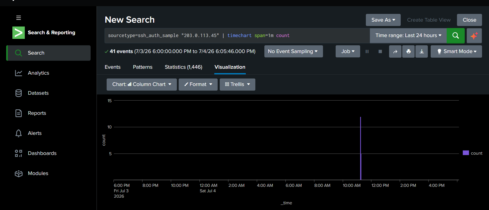
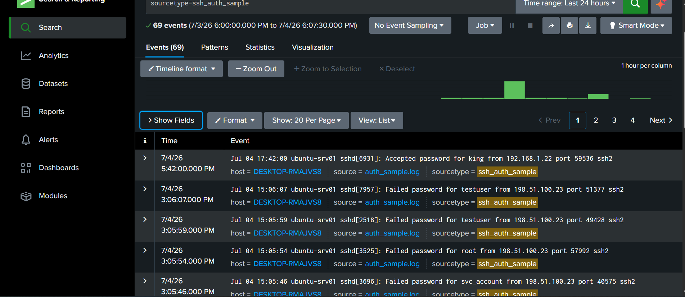
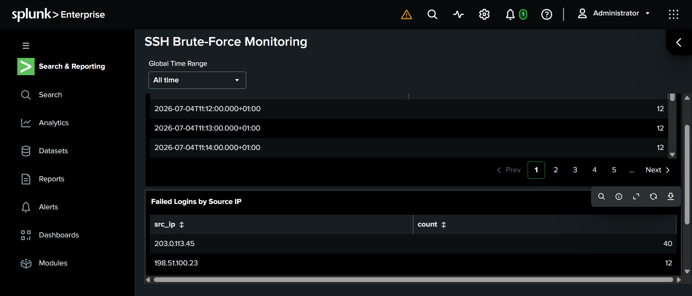

# Splunk SOC Lab — SSH Brute-Force Detection

## Overview
Hands-on Splunk exercise simulating a real SOC Tier 1 investigation: detecting and confirming a brute-force SSH attack using SPL (Search Processing Language).

## Scenario
A synthetic SSH authentication log (`auth_sample.log`) was ingested into Splunk, containing a mix of normal logins and two brute-force bursts from external IPs.

## Investigation Steps

### 1. Identify failed login volume by source IP
```spl
sourcetype=ssh_auth_sample "Failed password" | rex "from (?<src_ip>\d+\.\d+\.\d+\.\d+)" | stats count by src_ip | sort -count
```
This extracts the source IP from raw log text (since it wasn't a pre-parsed field) and counts failed attempts per IP.

**Result:** IP `203.0.113.45` generated significantly more failed attempts than `198.51.100.23`, flagging it as the primary suspect.



### 2. Confirm whether the attack succeeded
```spl
sourcetype=ssh_auth_sample "Accepted password" "203.0.113.45"
```
Checked whether the flagged IP appeared in any successful login events.

**Result:** A successful login from `203.0.113.45` was found immediately following the failed-login burst — confirming the brute-force attempt succeeded.



### 3. Visualize the attack timeline
```spl
sourcetype=ssh_auth_sample "203.0.113.45" | timechart span=1m count
```
Aggregated events from the attacking IP into 1-minute buckets to visualize the burst pattern over time.

**Result:** A clear spike in activity is visible during the brute-force window, followed by the successful login.



### 4. Review raw source data
Raw ingested log data confirming the dataset structure before analysis.



## Dashboard
Both key searches were saved as panels on a persistent dashboard ("SSH Brute-Force Monitoring") in Dashboard Studio — turning the one-off investigation into a reusable monitoring view.



## Findings
- `203.0.113.45` attempted ~40 rapid logins across multiple usernames in a short window, consistent with brute-force / credential-stuffing behavior.
- The attack succeeded, indicating a compromised credential.
- A second, smaller failed-login burst from `198.51.100.23` was also detected but did not result in a successful login.

## Recommended Response 
- Force password reset on the compromised account.
- Block/blacklist `203.0.113.45` at the firewall.
- Review post-login activity for signs of lateral movement or data access.
- Add a correlation rule/alert for future high-volume failed logins from a single IP.

## Tools Used
- Splunk Enterprise (local install)
- SPL commands: `rex`, `stats`, `sort`, `timechart`
- Dashboard Studio (persistent monitoring dashboard)
